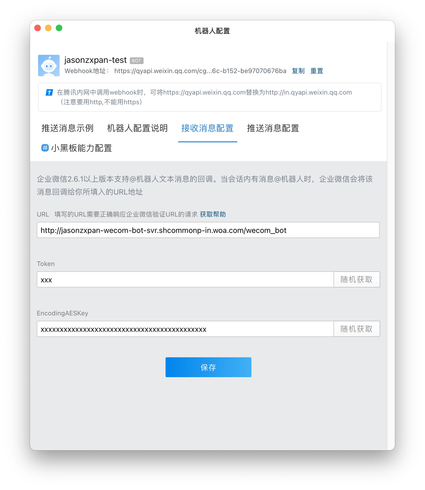
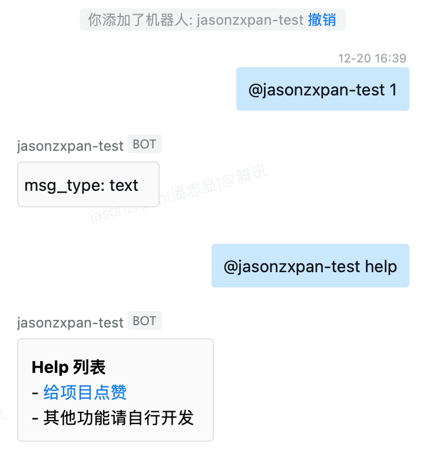
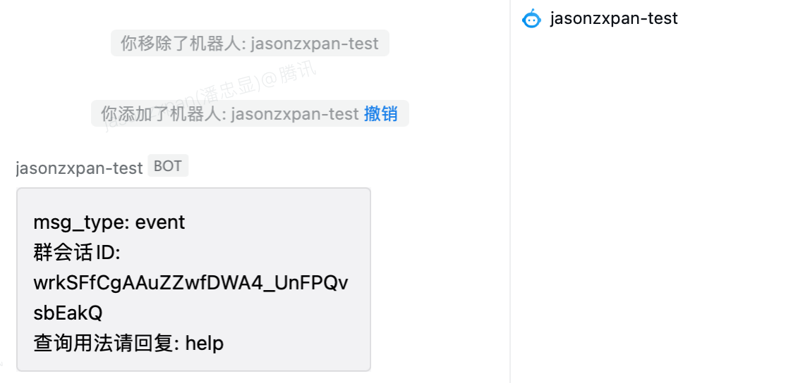
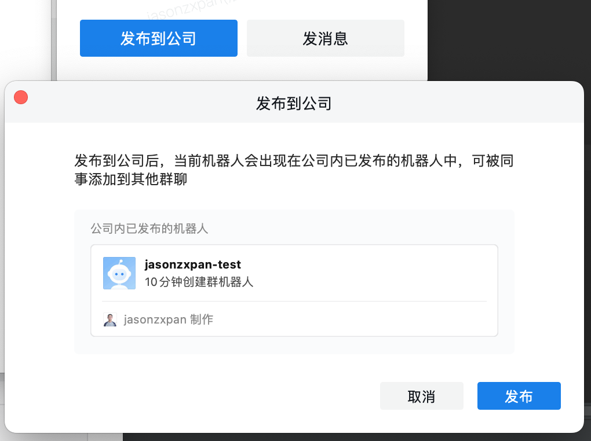
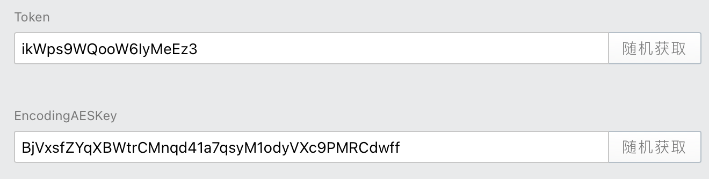
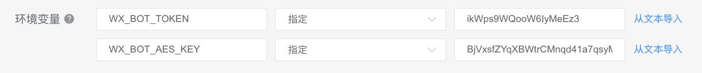
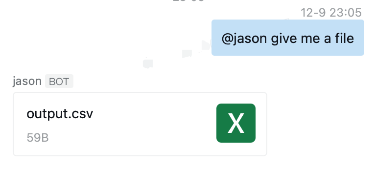

# 企业微信机器人回调服务

如果项目能给你带来些许便利，请不吝 Star

- 2024-12-09 新增发送主动文件功能(可以由消息触发)

## 1. 介绍

本项目是一个基于 [Flask](https://flask.palletsprojects.com/en/1.1.x/)的**企业微信机器人回调功能的接口服务简单框架**
。使用者只需要实现两个简单的函数，即可快速搭建一个企业微信机器人回调功能的接口服务。

实现过程参考企业微信机器人[回调功能说明文档](https://developer.work.weixin.qq.com/document/path/99399)
，以及相关文档中指引使用的[加解密脚本](https://github.com/sbzhu/weworkapi_python/tree/master/callback)。

## 2. 使用

这里提供一个 [demo.py](./demo/demo.py)，只要安装好依赖，修改好配置，即可直接进行部署服务。

### 2.1 本地调试

需要安装依赖，然后拉起 demo.py 即可(*这里暂时使用固定的 token 和 AESKey，后续在实际配置时可以替换掉*)：

```bash
pip3 install wecom-bot-svr
python3 demo.py
```

拉起服务后，可以使用 curl 进行测试(下边的测试链接对应demo中原始的 token 和 AESKey)：

```bash
curl 'http://127.0.0.1:5001/wecom_bot?msg_signature=09380007d4f0891d966988e5450ad794c77fa01c&timestamp=1703041184&nonce=1703023880&echostr=oCdlC8pJ%2FDIjXnC8F9reyjDYlSImCmIgxA4prPD%2Bl2Fj5qBHjFiWnpelQofsDCJrSEvNVTET6oQmoXLQxzUkyQ%3D%3D'
```

### 2.2 Docker方式部署

如果你计划单独的去部署这个机器人回调服务，可以直接使用我这里提供的Docker方式。

```bash
cd demo
docker build -t wx_bot docker.io/panzhongxian/wecom-bot-svr-demo:latest .
docker push docker.io/panzhongxian/wecom-bot-svr-demo:latest
```

然后在对应的平台中选择镜像部署，配置好对应的域名，即可获得在后续步骤中需要的回调地址。

如果你需要跟别的服务部署在一起，或者直接在CVM的机器上启动，在运行之前，记得安装 `wecom-bot-svr` 即可

### 2.3 配置企业微信群机器人

找一个群，在右上角点击「...」，点击「添加群机器人」，点击「接收消息配置」， 这里对应 demo 我们填入回调地址、token、AESKey。



如果服务正常，这里将会保存成功；如果服务异常，这里会提示失败。

### 2.4 测试

在添加到群中之后，可以在群中发送消息。demo里有**实现 help 和普通消息的回复**功能:



也可以移除再添加，这里展示的是**加入群的事件触发消息发送**的功能:



### 2.5 发布到公司

查看机器人资料，有一个发布到公司的按钮，只有发布之后的机器人，才能被公司其他同事搜索到，才可以被添加到其他的群聊当中：



## 3. Token和AESKey的管理

为了方便，demo中直接使用固定的 Token 和 AESKey，实际使用中，建议直接利用机器人配置页面的**随机生成**按钮获得。



删除代码中传入的 token 和 key，直接将其以配置的方式传入到服务中即可(
三个环境变量 `WX_BOT_TOKEN`, `WX_BOT_AES_KEY`, `WX_BOT_CORP_ID`):

```python
server = app.WecomBotServer(bot_name, host, port, path='/wecom_bot')
```



## 4. demo.py 代码解析

只要你看懂了 demo.py 里边做了什么工作，就可以修改他，实现自己机器人的回复逻辑了。

- `msg_handler`: 消息处理函数，简单的实现了 help 和普通消息的回复功能
- `event_handler`: 事件处理函数，简单的实现了加入群聊的事件触发消息发送的功能
- `WecomBotServer`: 企业微信机器人回调服务的接口服务，实现了加解密的功能，运行后能拉起 HTTP 服务
- 通过`set_message_handler`和`set_event_handler`将消息处理函数和事件处理函数注册到服务中

### 消息格式说明

`msg_handler(req_msg) -> rsp_msg`：消息处理函数将接收一个请求消息对象，返回一个响应消息对象。

所有机器人接收到的消息和事件，罗列在 req_msg.py 中，会作为 msg_handler 的输入，已经提取到具体的格式，用户可以根据自己的需求使用。

机器人发送消息只有两种形式，一种是 Text，另外一种是 Markdown，定义在 rsp_msg.py 文件当中。两种消息都只需要填写 content 内容即可。

## 5. 发送文件



原理链接：<https://developer.work.weixin.qq.com/document/path/91770#%E6%96%87%E4%BB%B6%E7%B1%BB%E5%9E%8B>

将上述上传文件、发送文件进行了封装，作为 WecomBotServer 的一个方法，可以被调用。

可以在消息处理函数中，通过调用 `send_file(chat_id, file_path)` 方法，将文件发送到群聊中。

当然，你也可以通过其他方式，调用该函数主动发送。

这里需要在构造函数中，增加传入 `bot_key`，用于发送文件的权限校验。这个key是在 WebHook 的链接中可以查询到：


同时，你需要加在消息处理函数的参数中，增加 `server` 参数，用于调用发送文件的方法。

```python
def msg_handler(req_msg: ReqMsg, server: WecomBotServer):
    ...
    # 生成文件、发送文件可以新启线程异步处理
    with open('output.txt', 'w') as f:
        f.write("This is a test file. Welcome to star easy-wx/wecom-bot-svr!")
    server.send_file(req_msg.chat_id, 'output.txt')
    return RspTextMsg()  # 不发送消息，只回复文件
```

## 6. TODO

- 单独启一个端口，接收主动发送消息的触发，然后让机器人在对应的群聊里发送消息
- 增加默认权限支持

