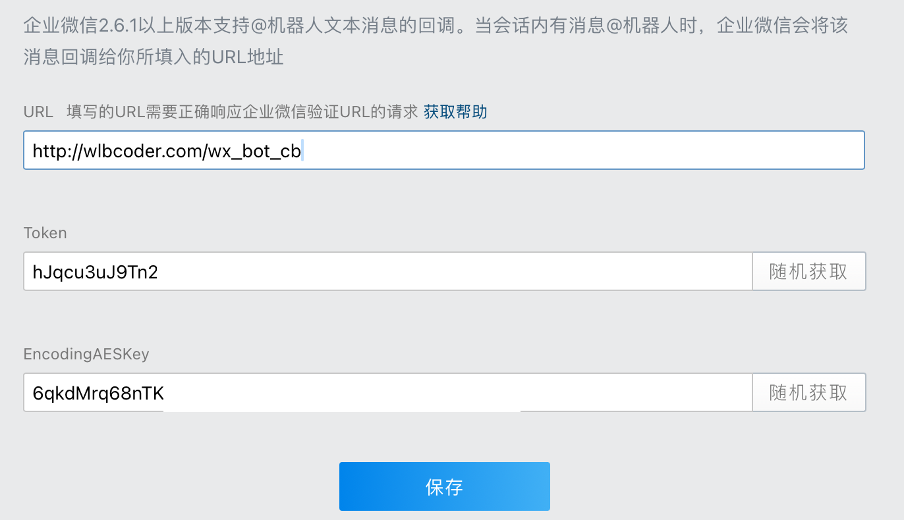

## 企业微信机器人回调服务

### 1. 介绍

本项目是一个基于 [Flask](https://flask.palletsprojects.com/en/1.1.x/)的**企业微信机器人回调功能的接口服务简单框架**
。使用者只需要实现两个简单的函数，即可快速搭建一个企业微信机器人回调功能的接口服务。

实现过程参考企业微信机器人[回调功能说明文档](https://developer.work.weixin.qq.com/document/path/99399)
，以及相关文档中指引使用的[加解密脚本](https://github.com/sbzhu/weworkapi_python/tree/master/callback)。

### 2. 使用

#### 2.1 安装

#### 2.1 配置回调相关参数

在企业微信，找到机器人，点击「点击配置」，配置进去准备使用的URL，并自动产生对应的 Token 和 Key：



这里的 Token 和 AesKey 是后续会使用的参数。 此时点击保存不能生效，因为企业微信会校验服务返回是否正常。
框架已经实现了校验的逻辑，但是需要先部署服务。

为了安全起见，Token 和 AesKey 不要直接写在代码中，建议通过环境变量传入：

```bash
WX_BOT_TOKEN=xxxxx
WX_BOT_AES_KEY=xxxxx
WX_BOT_CORP_ID=xxxxx
```

#### 2.2 实现回调

参考 demo.py 中的实现，主要步骤：

- 创建Server对象，如果 token, aes_key, corp_id 打算按照环境变量的方式传入，则这里直接不用填最后三个参数。
- 定义两个函数：消息处理函数、事件处理函数
- 将两个函数注册到 Server 对象中
- 启动服务

```python
token = "xxxxxxx"
aes_key = "xxxxxxxxxxxxxxxxxxxxxxxxxxxxxxxxxxxxxxxxxxx"
corp_id = ""
host = "0.0.0.0"
port = 5001
server = app.WecomBotServer("wx_bot", host, port, token=token, aes_key=aes_key, corp_id=corp_id)


def msg_handler(user_info, msg_type, content, xml_tree):
    print(user_info, msg_type, content)
    return "hello"


def event_handler(user_info, event_type, xml_tree):
    print(user_info, event_type)
    return "hello"


server.set_message_handler(msg_handler)
server.set_event_handler(event_handler)
server.run()
```


#### 2.3 部署服务


